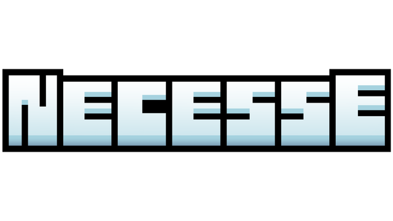

  

Necesse is a top-down sandbox action-adventure game in a procedurally generated world.

_[Steam](https://store.steampowered.com/app/1169040/Necesse/)_
_[Wiki](https://necessewiki.com/)_

## Translating

See [TRANSLATING](TRANSLATING.md).

## Feature Requests

Post feature requests and feedback [here](https://discord.gg/nku495HeT8).

--old?--
***Unofficial translations***

Every language must have lang.localname and lang.engname to be loaded.      
*File must be saved with UTF-8 encoding.*

\<***text***> *will be replaced with some other text or value.*          
***"§"*** *following a number, letter or #hexcode means the following text will be formatted.*         
***"\n"*** *means go to next line.*             
***[item/input=...]*** *will be replaced by an icon of the item/control key.*          

With every game update, all included language files will be updated with missing translations.             
This means you can search for MISSING_TRANSLATION to find and add them.        

If a translation is the same as english, make sure to add `SAME_TRANSLATION:` before the translation key,         
similar to how it is before missing translation. It is also possible to force this update my clicking the language in game while holding down shift.         
